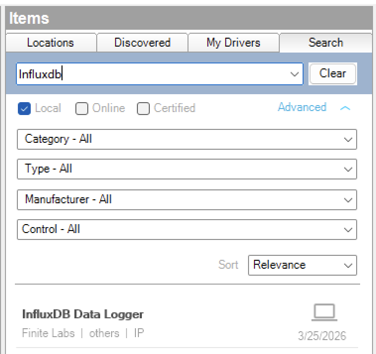

---

# Overview

> DISCLAIMER: This software is neither affiliated with nor endorsed by either
> Control4 or InfluxData.

The InfluxDB Data Logger driver allows you to log Control4 variable changes to
an InfluxDB time-series database. Configure measurements, bind Control4
variables as fields or tags, and let the driver handle batched writes with
automatic offline buffering and retry.

# Index

- [System Requirements](#system-requirements)
- [Features](#features)
- [Installer Setup](#installer-setup)
  - [Driver Installation](#driver-installation)
  - [Driver Setup](#driver-setup)
    - [Driver Properties](#driver-properties)
      - [Cloud Settings](#cloud-settings)
      - [Driver Settings](#driver-settings)
      - [InfluxDB Settings](#influxdb-settings)
      - [Offline Buffer & Retry](#offline-buffer--retry)
      - [Measurement Configuration](#measurement-configuration)
    - [Driver Actions](#driver-actions)
- [Programming](#programming)
  - [Events](#events)
  - [Variables](#variables)
  - [Conditionals](#conditionals)
- [Support](#support)
- [Changelog](#changelog)

# System Requirements

- Control4 OS 3.3.0 or later
- InfluxDB 3.x instance accessible from the Control4 controller over the network
- A valid InfluxDB API token with write permissions

# Features

- Log any Control4 variable to InfluxDB as a field or tag
- Define multiple measurements with independent write intervals
- Configurable timestamp precision (nanoseconds, microseconds, milliseconds,
  seconds)
- Automatic offline buffering with configurable capacity
- Exponential-backoff retry when the InfluxDB server is unreachable
- Extended outage notification event
- Connection status events and conditionals for programming

# Installer Setup

## Driver Installation

Driver installation and setup are similar to most other ip-based drivers. Below
is an outline of the basic steps for your convenience.

1.  Download the latest `control4-influxdb.zip` from
    [Github](https://github.com/finitelabs/control4-influxdb/releases/latest).

2.  Extract and
    [install](https://www.control4.com/help/c4/software/cpro/dealer-composer-help/content/composerpro_userguide/adding_drivers_manually.htm)
    all `.c4z` files.

3.  Use the "Search" tab to find the "Influxdb" driver and add it to your
    project.

    

4.  Configure the [InfluxDB Settings](#influxdb-settings) with the connection
    information for your InfluxDB instance. The
    [`Driver Status`](#driver-status-read-only) will display `Connected`
    automatically once the URL, API Token, and Database are set.

5.  Create measurements using the
    [Measurement Configuration](#measurement-configuration) properties and bind
    Control4 variables to them.

## Driver Setup

### Driver Properties

#### Cloud Settings

##### Automatic Updates \[ Off \| **_On_** \]

Enables or disables automatic driver updates from GitHub releases.

##### Update Channel \[ **_Production_** \| Prerelease \]

Sets the update channel for which releases are considered during automatic
updates from GitHub releases.

#### Driver Settings

##### Driver Status (read-only)

Displays the current status of the driver.

##### Driver Version (read-only)

Displays the current version of the driver.

##### Log Level \[ 0 - Fatal \| 1 - Error \| 2 - Warning \| **_3 - Info_** \| 4 - Debug \| 5 - Trace \| 6 - Ultra \]

Sets the logging level. Default is `3 - Info`.

##### Log Mode \[ **_Off_** \| Print \| Log \| Print and Log \]

Sets the logging mode. Default is `Off`.

#### InfluxDB Settings

##### InfluxDB URL

Full URL of the InfluxDB instance (e.g., `http://influxdb.local:8086`).

##### API Token

InfluxDB API authentication token. This field is masked in Composer Pro.

##### Database

InfluxDB database (bucket) name to write into.

##### Write Precision \[ ns \| us \| **_ms_** \| s \]

Timestamp precision for line protocol writes. Default is `ms`.

##### Default Write Interval \[ 10s \| 30s \| **_1m_** \| 5m \| 15m \]

How often the driver flushes buffered data points to InfluxDB. Individual
measurements can override this value. Default is `1m`.

#### Offline Buffer & Retry

##### Max Buffer Size

Maximum number of data points to buffer when the InfluxDB server is unreachable.
Default is `10000`.

##### Outage Notification Threshold \[ 1m \| **_5m_** \| 15m \| 30m \| 1h \]

Fires the **Extended Outage** event after the driver has been disconnected for
this duration. Default is `5m`.

##### Offline Buffer Size (read-only)

Displays the current number of data points in the offline buffer.

##### Connection State (read-only)

Displays the current connection state (`Connected`, `Disconnected`, or
`Reconnecting`).

#### Measurement Configuration

##### Add Measurement

Enter a measurement name and press **Set** to create it. The field clears
automatically after the measurement is created.

##### Remove Measurement

Select a measurement to remove. Hidden when no measurements exist.

##### Configure Measurement

Select a measurement to configure. When a measurement is selected, the
configuration properties below become visible. Hidden when no measurements
exist.

##### Add Field

Select a Control4 variable to add as a field (numeric data) to the currently
selected measurement.

##### Remove Field

Select a field variable to remove from the currently selected measurement.
Hidden when no fields are configured.

##### Add Tag

Select a Control4 variable to add as a tag (metadata/label) to the currently
selected measurement.

##### Remove Tag

Select a tag variable to remove from the currently selected measurement. Hidden
when no tags are configured.

##### Measurement Write Interval \[ **_Default_** \| 10s \| 30s \| 1m \| 5m \| 15m \]

Sets the write interval for the selected measurement. Use `Default` to inherit
the global **Default Write Interval**. Default is `Default`.

##### Measurement Enabled \[ **_On_** \| Off \]

Enables or disables data collection for the selected measurement. Default is
`On`.

### Driver Actions

#### Update Drivers

Trigger the driver to update from the latest release on GitHub, regardless of
the current version.

#### Clear Offline Buffer

Discards all data points in the offline buffer without writing them.

# Programming

## Events

| Event           | Description                                                                                   |
| --------------- | --------------------------------------------------------------------------------------------- |
| Connected       | Fires when the driver successfully connects to the InfluxDB server                            |
| Disconnected    | Fires when the driver loses connectivity to the InfluxDB server                               |
| Write Error     | Fires when a batch write returns a non-2xx response from InfluxDB                             |
| Buffer Full     | Fires when the write buffer reaches the configured **Max Buffer Size**                        |
| Extended Outage | Fires when the driver has been disconnected longer than the **Outage Notification Threshold** |

## Variables

This driver does not expose Control4 variables. It subscribes to variables from
other drivers to log their values to InfluxDB.

## Conditionals

| Conditional        | Type | Description                                                        |
| ------------------ | ---- | ------------------------------------------------------------------ |
| INFLUXDB_CONNECTED | BOOL | `True` when the driver is connected to InfluxDB, `False` otherwise |

# Support

If you have any questions or issues integrating this driver with Control4, you
can file an issue on GitHub:

<https://github.com/finitelabs/control4-influxdb/issues/new>

# Changelog

## Unreleased

### Changed

- Use consistent property sync pattern (`SetDeviceProperties`) across driver instances

## v20260325 - 2026-03-25

### Added

- Initial Release
