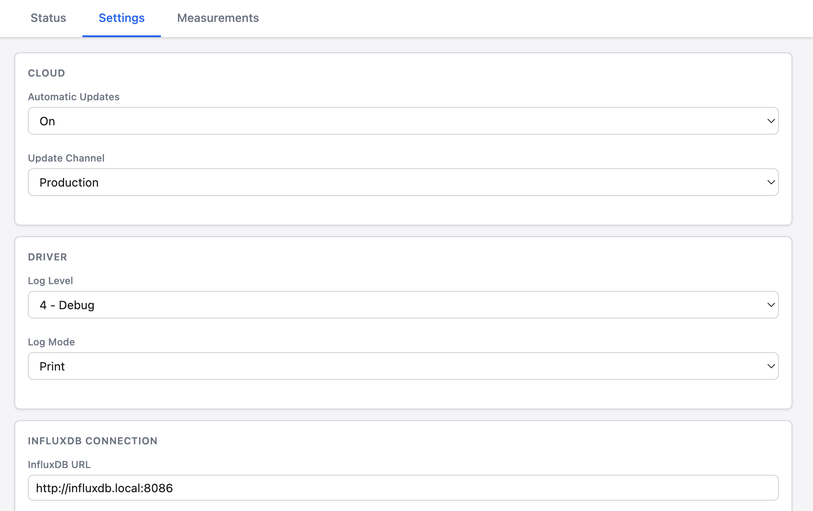
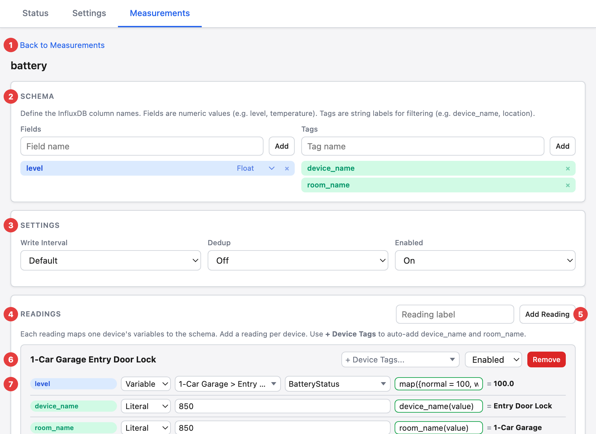

<!-- Copyright 2026 Finite Labs, LLC. All rights reserved. -->

______________________________________________________________________

# Overview

> DISCLAIMER: This software is neither affiliated with nor endorsed by either
> Control4 or InfluxData.

The InfluxDB Data Logger driver allows you to log Control4 variable changes to
an InfluxDB time-series database. Configure measurements, bind Control4
variables as fields or tags, and let the driver handle batched writes with
automatic offline buffering and retry.

# Index

- [System Requirements](#system-requirements)

- [Features](#features)

- [Installer Setup](#installer-setup)

  - [Driver Installation](#driver-installation)
  - [Driver Setup](#driver-setup)
    - [Driver Tabs](#driver-tabs)
      - [Settings](#settings)
    - [Driver Properties](#driver-properties)
      - [Cloud Settings](#cloud-settings)
      - [Driver Settings](#driver-settings)
      - [InfluxDB Settings](#influxdb-settings)
      - [Offline Buffer & Retry](#offline-buffer--retry)
    - [Driver Actions](#driver-actions)

- [Programming](#programming)

  - [Events](#events)
  - [Variables](#variables)
  - [Conditionals](#conditionals)

- [Support](#support)

- [Changelog](#changelog)

# System Requirements

- Control4 OS 3.3.0 or later
- InfluxDB 3.x instance accessible from the Control4 controller over the network
- A valid InfluxDB API token with write permissions

# Features

- Log any Control4 variable to InfluxDB as a field or tag
- Define multiple measurements with independent write intervals
- Configurable timestamp precision (nanoseconds, microseconds, milliseconds,
  seconds)
- Automatic offline buffering with configurable capacity
- Exponential-backoff retry when the InfluxDB server is unreachable
- Extended outage notification event
- Connection status events and conditionals for programming

# Installer Setup

## Driver Installation

Driver installation and setup are similar to most other ip-based drivers. Below
is an outline of the basic steps for your convenience.

1. Download the latest `control4-influxdb.zip` from
   [Github](https://github.com/finitelabs/control4-influxdb/releases/latest).
1. Extract and
   [install](https://www.control4.com/help/c4/software/cpro/dealer-composer-help/content/composerpro_userguide/adding_drivers_manually.htm)
   all `.c4z` files.
1. Use the "Search" tab to find the "Influxdb" driver and add it to your
   project.
    
1. Configure the [InfluxDB Settings](#influxdb-settings) with the connection
   information for your InfluxDB instance. The
   [`Driver Status`](#driver-status-read-only) will display `Connected`
   automatically once the URL, API Token, and Database are set.
1. Create measurements using the
   [Measurement Configuration](#measurement-configuration) properties and bind
   Control4 variables to them.

## Driver Setup

### Driver Tabs

Additional tabs shown while in the
[System Design mode](https://www.control4.com/help/c4/software/cpro/dealer-composer-help/content/composerpro_userguide/system_design_view.htm),
next to the "Properties", "Actions", "Documentation", and "Lua" tabs.

#### Settings

The Settings tab contains three views:

##### Status

Displays the current connection status and write metrics.

1. **Connection** - shows the connection state, InfluxDB URL, and database name.
1. **Write Metrics** - points buffered, written, dropped, and write errors.

##### Settings

Displays the driver properties in a grouped layout. See
[Driver Properties](#driver-properties) for details on each setting.

##### Measurements

Configure measurements, schemas, and per-device readings.

1. **+ Add Measurement** - create a new measurement (the name becomes the
   InfluxDB table name)
1. **Measurement name** - click to open the editor. The table shows configured
   fields, tags, reading count, and status at a glance.
1. **Delete** - remove the measurement and all its readings

##### Measurement Editor

Click a measurement name in the list to open the editor. The editor lets you
define the schema, configure write settings, and map device variables to each
column.

1. **Back to Measurements** - return to the list view
1. **Schema** - define the InfluxDB columns. Add **fields** (numeric data like
   `level`, `temperature`) and **tags** (string labels like `device_name`,
   `room_name`). Use the input boxes and **Add** buttons to create them.
1. **Settings** - **Write Interval** controls how often data is sent (use
   `Default` to inherit the global interval). **Dedup** skips writes when values
   haven't changed. **Enabled** toggles data collection.
1. **Readings** - each reading represents one device's data mapped to this
   measurement's schema. Add one reading per device you want to log.
1. **Add Reading** - enter a label and click to add a new reading
1. **Reading card** - shows the reading label, **+ Device Tags** shortcut
   (auto-populates `device_name` and `room_name` from the device ID),
   **Enabled** toggle, and **Remove** button
1. **Mapping row** - one row per schema column. Each row has:
   - **Name** - the field or tag from the schema (blue = field, green = tag)
   - **Source** - `Variable` (from a device) or `Literal` (a fixed value)
   - **Device** - searchable picker for the Control4 device (Variable only)
   - **Variable** - the device variable to read (Variable only)
   - **Transform** - optional Lua expression (see [Transforms](#transforms))
   - **Preview** - live result evaluated on the controller

##### Transforms

Transforms are standard Lua expressions. The raw value is available as `value`.

| Function             | Description                           | Example                             |
| -------------------- | ------------------------------------- | ----------------------------------- |
| `device_name(value)` | Resolve device ID to its display name | `850` → `Entry Door Lock`           |
| `room_name(value)`   | Resolve device ID to its room name    | `850` → `1-Car Garage`              |
| `map({key = val})`   | Map string values to numbers          | `map({normal = 100, warning = 30})` |
| `c2f(value)`         | Celsius to Fahrenheit                 | `20` → `68`                         |
| `f2c(value)`         | Fahrenheit to Celsius                 | `68` → `20`                         |

You can also use any Lua math expression:

- `value * 100` - scale a value
- `math.floor(value)` - round down
- `tonumber(value) or 0` - ensure numeric

> **Note:** Transform expressions use standard Lua syntax. Table constructors
> use `=` not `:` (e.g., `map({normal = 100})` not `map({"normal": 100})`).

### Driver Properties

#### Cloud Settings

##### Automatic Updates \[ Off | **_On_** \]

Enables or disables automatic driver updates from GitHub releases.

##### Update Channel \[ **_Production_** | Prerelease \]

Sets the update channel for which releases are considered during automatic
updates from GitHub releases.

#### Driver Settings

##### Driver Status (read-only)

Displays the current status of the driver.

##### Driver Version (read-only)

Displays the current version of the driver.

##### Log Level \[ 0 - Fatal | 1 - Error | 2 - Warning | **_3 - Info_** | 4 - Debug | 5 - Trace | 6 - Ultra \]

Sets the logging level. Default is `3 - Info`.

##### Log Mode \[ **_Off_** | Print | Log | Print and Log \]

Sets the logging mode. Default is `Off`.

#### InfluxDB Settings

##### InfluxDB URL

Full URL of the InfluxDB instance (e.g., `http://influxdb.local:8086`).

##### API Token

InfluxDB API authentication token. This field is masked in Composer Pro.

##### Database

InfluxDB database (bucket) name to write into.

##### Write Precision \[ ns | us | **_ms_** | s \]

Timestamp precision for line protocol writes. Default is `ms`.

##### Default Write Interval \[ 10s | 30s | **_1m_** | 5m | 15m \]

How often the driver flushes buffered data points to InfluxDB. Individual
measurements can override this value. Default is `1m`.

#### Offline Buffer & Retry

##### Max Buffer Size

Maximum number of data points to buffer when the InfluxDB server is unreachable.
Default is `10000`.

##### Outage Notification Threshold \[ 1m | **_5m_** | 15m | 30m | 1h \]

Fires the **Extended Outage** event after the driver has been disconnected for
this duration. Default is `5m`.

##### Offline Buffer Size (read-only)

Displays the current number of data points in the offline buffer.

### Driver Actions

#### Update Drivers

Trigger the driver to update from the latest release on GitHub, regardless of
the current version.

#### Clear Offline Buffer

Discards all data points in the offline buffer without writing them.

# Programming

## Events

| Event           | Description                                                                                   |
| --------------- | --------------------------------------------------------------------------------------------- |
| Connected       | Fires when the driver successfully connects to the InfluxDB server                            |
| Disconnected    | Fires when the driver loses connectivity to the InfluxDB server                               |
| Write Error     | Fires when a batch write returns a non-2xx response from InfluxDB                             |
| Buffer Full     | Fires when the write buffer reaches the configured **Max Buffer Size**                        |
| Extended Outage | Fires when the driver has been disconnected longer than the **Outage Notification Threshold** |

## Variables

This driver does not expose Control4 variables. It subscribes to variables from
other drivers to log their values to InfluxDB.

## Conditionals

| Conditional        | Type | Description                                                        |
| ------------------ | ---- | ------------------------------------------------------------------ |
| INFLUXDB_CONNECTED | BOOL | `True` when the driver is connected to InfluxDB, `False` otherwise |

# Support

If you have any questions or issues integrating this driver with Control4, you
can file an issue on GitHub:

https://github.com/finitelabs/control4-influxdb/issues/new

# Changelog

<!--
Template for a new release entry (copy below the heading, fill in, uncomment):

## v[Version] - YYYY-MM-DD

### Added
- Added

### Fixed
- Fixed

### Changed
- Changed

### Removed
- Removed
-->

## v20260816 - 2026-08-16

### Added

- A schema field can pin its InfluxDB type instead of inferring it from each
  value, so a measurement whose readings mix whole and fractional numbers is no
  longer rejected. The mapping preview shows the pinned type, so `0`, `0.0`,
  `"0"` and `false` are told apart and a lossy pin is visible before saving.
- Agents are listed in the device picker under their own heading, so variables
  that live on an agent, such as Composer global variables, can be logged.

### Fixed

- All of a measurement's readings on the same schedule are sent in one write,
  instead of one request per reading saturating the controller until writes
  timed out.
- Points carry the time they were read, rather than the time the write arrived,
  which drifted by minutes whenever a write was retried.
- A measurement no longer starts a write while one is still outstanding, so a
  slow or unreachable InfluxDB no longer builds up retries it cannot clear.
- Reloading or removing the driver while InfluxDB is unreachable stops cleanly
  instead of erroring during shutdown.
- A variable that never changes after startup is logged instead of being skipped
  indefinitely.
- Disabling a measurement stops its writes instead of leaving its buffered
  points retrying.
- A value of zero shows in the mapping preview instead of appearing blank.
- A device's own variables are always listed before its proxies' in the variable
  picker.
- Device and variable dropdowns in the measurement editor are no longer cut off
  by the surrounding card, and stay on screen near the edges of the pane.
- A device that a driver exposes through a proxy of the same name now appears
  once in the device picker instead of several times, and its variable list is
  grouped by where each variable comes from. Proxies that stand for something of
  their own, such as a security panel's areas or a receiver's tuner, are still
  listed separately. Devices that genuinely share a room and name are told apart
  by their device id. Devices with no variables are hidden when mapping a field
  or tag, and remain available under Device Tags.
- A long measurement name no longer pushes the Delete button out of reach in the
  measurements table.

### Changed

- The web UI fills the available width and adapts to narrow panes.

## v20260331 - 2026-03-31

### Added

- Web UI for configuring measurement schemas, per-device readings, and
  transforms

## v20260325 - 2026-03-25

### Added

- Initial Release
