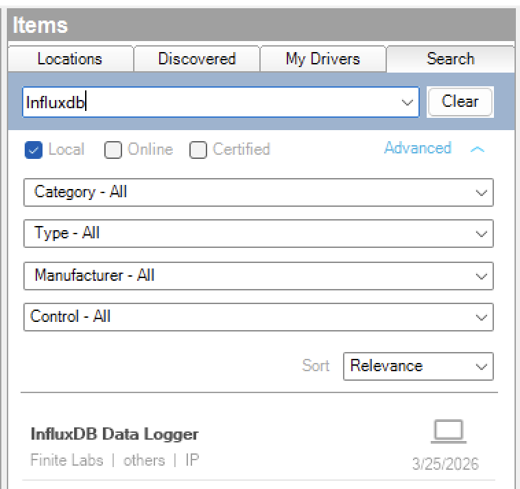
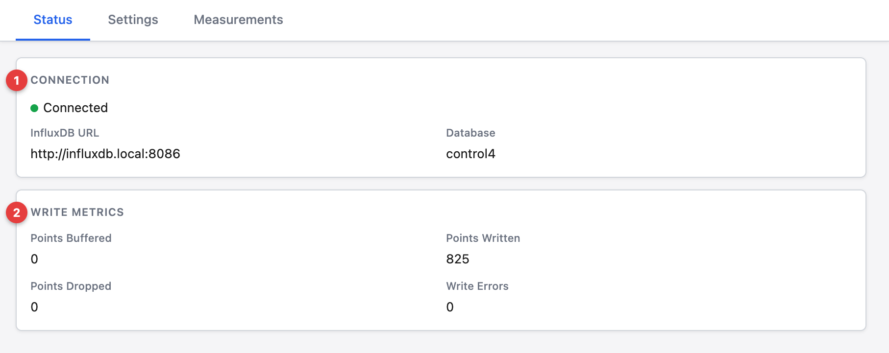
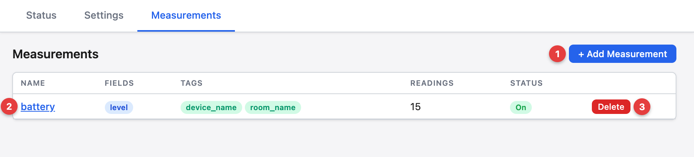

<!-- Copyright 2026 Finite Labs, LLC. All rights reserved. -->

______________________________________________________________________

# Overview

<!-- #ifndef DRIVERCENTRAL -->

> DISCLAIMER: This software is neither affiliated with nor endorsed by either
> Control4 or InfluxData.

<!-- #endif -->

The InfluxDB Data Logger driver allows you to log Control4 variable changes to
an InfluxDB time-series database. Configure measurements, bind Control4
variables as fields or tags, and let the driver handle batched writes with
automatic offline buffering and retry.

# Index

- [System Requirements](#system-requirements)
- [Features](#features)
- [Installer Setup](#installer-setup)
  <!-- #ifdef DRIVERCENTRAL -->
  - [DriverCentral Cloud Setup](#drivercentral-cloud-setup)
  <!-- #endif -->
  - [Driver Installation](#driver-installation)
  - [Driver Setup](#driver-setup)
    - [Driver Tabs](#driver-tabs)
      - [Settings](#settings)
    - [Driver Properties](#driver-properties)
      - [Cloud Settings](#cloud-settings)
      - [Driver Settings](#driver-settings)
      - [InfluxDB Settings](#influxdb-settings)
      - [Offline Buffer & Retry](#offline-buffer--retry)
    - [Driver Actions](#driver-actions)
- [Programming](#programming)
  - [Events](#events)
  - [Variables](#variables)
  - [Conditionals](#conditionals)
  <!-- #ifdef DRIVERCENTRAL -->
- [Developer Information](#developer-information)

<!-- #endif -->

- [Support](#support)
- [Changelog](#changelog)

# System Requirements

- Control4 OS 3.3.0 or later
- InfluxDB 3.x instance accessible from the Control4 controller over the network
- A valid InfluxDB API token with write permissions

# Features

- Log any Control4 variable to InfluxDB as a field or tag
- Define multiple measurements with independent write intervals
- Configurable timestamp precision (nanoseconds, microseconds, milliseconds,
  seconds)
- Automatic offline buffering with configurable capacity
- Exponential-backoff retry when the InfluxDB server is unreachable
- Extended outage notification event
- Connection status events and conditionals for programming

# Installer Setup

<!-- #ifdef DRIVERCENTRAL -->

## DriverCentral Cloud Setup

> If you already have the
> [DriverCentral Cloud driver](https://drivercentral.io/platforms/control4-drivers/utility/drivercentral-cloud-driver/)
> installed in your project you can continue to
> [Driver Installation](#driver-installation).

This driver relies on the DriverCentral Cloud driver to manage licensing and
automatic updates. If you are new to using DriverCentral you can refer to their
[Cloud Driver](https://help.drivercentral.io/407519-Cloud-Driver) documentation
for setting it up.

<!-- #endif -->

## Driver Installation

Driver installation and setup are similar to most other ip-based drivers. Below
is an outline of the basic steps for your convenience.

<!-- #ifdef DRIVERCENTRAL -->

1. Download the latest `control4-influxdb.zip` from
   [DriverCentral](https://drivercentral.io/platforms/control4-drivers/utility/influxdb).
1. Extract and
   [install](https://www.control4.com/help/c4/software/cpro/dealer-composer-help/content/composerpro_userguide/adding_drivers_manually.htm)
   all `.c4z` files.
1. Use the "Search" tab to find the "Influxdb" driver and add it to your
   project.
    
1. Select the newly added driver in the "System Design" tab. You will notice
   that the `Cloud Status` reflects the license state. If you have purchased a
   license it will show `License Activated`, otherwise `Trial Running` and
   remaining trial duration.
1. You can refresh license status by selecting the "DriverCentral Cloud" driver
   in the "System Design" tab and perform the "Check Drivers" action.
    
1. Configure the [InfluxDB Settings](#influxdb-settings) with the connection
   information for your InfluxDB instance. The
   [`Driver Status`](#driver-status-read-only) will display `Connected`
   automatically once the URL, API Token, and Database are set.
1. Create measurements using the
   [Measurement Configuration](#measurement-configuration) properties and bind
   Control4 variables to them.

<!-- #else -->

1. Download the latest `control4-influxdb.zip` from
   [Github](https://github.com/finitelabs/control4-influxdb/releases/latest).
1. Extract and
   [install](https://www.control4.com/help/c4/software/cpro/dealer-composer-help/content/composerpro_userguide/adding_drivers_manually.htm)
   all `.c4z` files.
1. Use the "Search" tab to find the "Influxdb" driver and add it to your
   project.
    
1. Configure the [InfluxDB Settings](#influxdb-settings) with the connection
   information for your InfluxDB instance. The
   [`Driver Status`](#driver-status-read-only) will display `Connected`
   automatically once the URL, API Token, and Database are set.
1. Create measurements using the
   [Measurement Configuration](#measurement-configuration) properties and bind
   Control4 variables to them.

<!-- #endif -->

## Driver Setup

### Driver Tabs

Additional tabs shown while in the
[System Design mode](https://www.control4.com/help/c4/software/cpro/dealer-composer-help/content/composerpro_userguide/system_design_view.htm),
next to the "Properties", "Actions", "Documentation", and "Lua" tabs.

#### Settings

The Settings tab contains three views:

##### Status

Displays the current connection status and write metrics.

1. **Connection** - shows the connection state, InfluxDB URL, and database name.
1. **Write Metrics** - points buffered, written, dropped, and write errors.

##### Settings

Displays the driver properties in a grouped layout. See
[Driver Properties](#driver-properties) for details on each setting.

##### Measurements

Configure measurements, schemas, and per-device readings.

1. **+ Add Measurement** - create a new measurement (the name becomes the
   InfluxDB table name)
1. **Measurement name** - click to open the editor. The table shows configured
   fields, tags, reading count, and status at a glance.
1. **Delete** - remove the measurement and all its readings

##### Measurement Editor

Click a measurement name in the list to open the editor. The editor lets you
define the schema, configure write settings, and map device variables to each
column.

1. **Back to Measurements** - return to the list view
1. **Schema** - define the InfluxDB columns. Add **fields** (numeric data like
   `level`, `temperature`) and **tags** (string labels like `device_name`,
   `room_name`). Use the input boxes and **Add** buttons to create them.
1. **Settings** - **Write Interval** controls how often data is sent (use
   `Default` to inherit the global interval). **Dedup** skips writes when values
   haven't changed. **Enabled** toggles data collection.
1. **Readings** - each reading represents one device's data mapped to this
   measurement's schema. Add one reading per device you want to log.
1. **Add Reading** - enter a label and click to add a new reading
1. **Reading card** - shows the reading label, **+ Device Tags** shortcut
   (auto-populates `device_name` and `room_name` from the device ID),
   **Enabled** toggle, and **Remove** button
1. **Mapping row** - one row per schema column. Each row has:
   - **Name** - the field or tag from the schema (blue = field, green = tag)
   - **Source** - `Variable` (from a device) or `Literal` (a fixed value)
   - **Device** - searchable picker for the Control4 device (Variable only)
   - **Variable** - the device variable to read (Variable only)
   - **Transform** - optional Lua expression (see [Transforms](#transforms))
   - **Preview** - live result evaluated on the controller

##### Transforms

Transforms are standard Lua expressions. The raw value is available as `value`.

| Function             | Description                           | Example                             |
| -------------------- | ------------------------------------- | ----------------------------------- |
| `device_name(value)` | Resolve device ID to its display name | `850` → `Entry Door Lock`           |
| `room_name(value)`   | Resolve device ID to its room name    | `850` → `1-Car Garage`              |
| `map({key = val})`   | Map string values to numbers          | `map({normal = 100, warning = 30})` |
| `c2f(value)`         | Celsius to Fahrenheit                 | `20` → `68`                         |
| `f2c(value)`         | Fahrenheit to Celsius                 | `68` → `20`                         |

You can also use any Lua math expression:

- `value * 100` - scale a value
- `math.floor(value)` - round down
- `tonumber(value) or 0` - ensure numeric

> **Note:** Transform expressions use standard Lua syntax. Table constructors
> use `=` not `:` (e.g., `map({normal = 100})` not `map({"normal": 100})`).

### Driver Properties

#### Cloud Settings

<!-- #ifdef DRIVERCENTRAL -->

##### Cloud Status (read-only)

Displays the DriverCentral cloud license status.

<!-- #endif -->

##### Automatic Updates \[ Off | **_On_** \]

<!-- #ifdef DRIVERCENTRAL -->

Enables or disables automatic driver updates via DriverCentral.

<!-- #else -->

Enables or disables automatic driver updates from GitHub releases.

##### Update Channel \[ **_Production_** | Prerelease \]

Sets the update channel for which releases are considered during automatic
updates from GitHub releases.

<!-- #endif -->

#### Driver Settings

##### Driver Status (read-only)

Displays the current status of the driver.

##### Driver Version (read-only)

Displays the current version of the driver.

##### Log Level \[ 0 - Fatal | 1 - Error | 2 - Warning | **_3 - Info_** | 4 - Debug | 5 - Trace | 6 - Ultra \]

Sets the logging level. Default is `3 - Info`.

##### Log Mode \[ **_Off_** | Print | Log | Print and Log \]

Sets the logging mode. Default is `Off`.

#### InfluxDB Settings

##### InfluxDB URL

Full URL of the InfluxDB instance (e.g., `http://influxdb.local:8086`).

##### API Token

InfluxDB API authentication token. This field is masked in Composer Pro.

##### Database

InfluxDB database (bucket) name to write into.

##### Write Precision \[ ns | us | **_ms_** | s \]

Timestamp precision for line protocol writes. Default is `ms`.

##### Default Write Interval \[ 10s | 30s | **_1m_** | 5m | 15m \]

How often the driver flushes buffered data points to InfluxDB. Individual
measurements can override this value. Default is `1m`.

#### Offline Buffer & Retry

##### Max Buffer Size

Maximum number of data points to buffer when the InfluxDB server is unreachable.
Default is `10000`.

##### Outage Notification Threshold \[ 1m | **_5m_** | 15m | 30m | 1h \]

Fires the **Extended Outage** event after the driver has been disconnected for
this duration. Default is `5m`.

##### Offline Buffer Size (read-only)

Displays the current number of data points in the offline buffer.

### Driver Actions

<!-- #ifndef DRIVERCENTRAL -->

#### Update Drivers

Trigger the driver to update from the latest release on GitHub, regardless of
the current version.

<!-- #endif -->

#### Clear Offline Buffer

Discards all data points in the offline buffer without writing them.

# Programming

## Events

| Event           | Description                                                                                   |
| --------------- | --------------------------------------------------------------------------------------------- |
| Connected       | Fires when the driver successfully connects to the InfluxDB server                            |
| Disconnected    | Fires when the driver loses connectivity to the InfluxDB server                               |
| Write Error     | Fires when a batch write returns a non-2xx response from InfluxDB                             |
| Buffer Full     | Fires when the write buffer reaches the configured **Max Buffer Size**                        |
| Extended Outage | Fires when the driver has been disconnected longer than the **Outage Notification Threshold** |

## Variables

This driver does not expose Control4 variables. It subscribes to variables from
other drivers to log their values to InfluxDB.

## Conditionals

| Conditional        | Type | Description                                                        |
| ------------------ | ---- | ------------------------------------------------------------------ |
| INFLUXDB_CONNECTED | BOOL | `True` when the driver is connected to InfluxDB, `False` otherwise |

<!-- #ifdef DRIVERCENTRAL -->

# Developer Information

Copyright © 2026 Finite Labs LLC

All information contained herein is, and remains the property of Finite Labs LLC
and its suppliers, if any. The intellectual and technical concepts contained
herein are proprietary to Finite Labs LLC and its suppliers and may be covered
by U.S. and Foreign Patents, patents in process, and are protected by trade
secret or copyright law. Dissemination of this information or reproduction of
this material is strictly forbidden unless prior written permission is obtained
from Finite Labs LLC. For the latest information, please visit
https://drivercentral.io/platforms/control4-drivers/utility/influxdb

<!-- #endif -->

# Support

<!-- #ifdef DRIVERCENTRAL -->

If you have any questions or issues integrating this driver with Control4 or
InfluxDB, you can contact us at
[driver-support@finitelabs.com](mailto:driver-support@finitelabs.com) or
call/text us at [+1 (949) 371-5805](tel:+19493715805).

<!-- #else -->

If you have any questions or issues integrating this driver with Control4, you
can file an issue on GitHub:

https://github.com/finitelabs/control4-influxdb/issues/new

<!-- #endif -->

<!-- #embed-changelog -->
